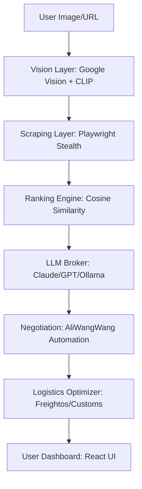

# B2B Wholesale Arbitrage Agent
[](https://www.python.org/)
[](https://fastapi.tiangolo.com/)
[](https://reactjs.org/)
[](https://opensource.org/licenses/MIT)

**The AI-powered commercial broker that finds factory-direct prices and negotiates deals for small shop owners.**

 

---

## Overview

`B2B-Wholesale-Arbitrage-Agent` is a sophisticated AI system designed to eliminate the language and process barriers preventing small retailers from accessing the world's lowest wholesale prices (primarily via platforms like **1688.com**, **Taobao**, and **Alibaba**).

By combining **Computer Vision**, **Browser Automation**, and **Large Language Models (LLMs)**, the agent transforms a simple product image into a fully negotiated wholesale quote.

### Key Capabilities
- **Reverse Visual Sourcing**: Uses Google Vision API and CLIP to find the original factory source of any retail product.
- **AI Negotiation Broker**: A pluggable LLM chain (Claude -> GPT-4o -> Ollama) that acts as a senior procurement agent.
- **Cultural Nuance Engine**: Generates professional business scripts in Mandarin Chinese, tailored to specific negotiation personas.
- **Landed Cost Optimizer**: Calculates total costs including freight (Sea/Air/Express) and destination country duties.
- **Self-Improving Knowledge Base**: Automatically updates its research on e-commerce retrieval using crawl4ai.

---

## Architecture



### Tech Stack
- **Backend**: FastAPI, SQLAlchemy, Celery, Redis.
- **AI/ML**: PyTorch, Transformers (CLIP), Anthropic SDK, OpenAI SDK.
- **Automation**: Playwright (Stealth Mode).
- **Frontend**: React 18, Tailwind CSS, Axios.
- **Security**: AES-256-GCM Encryption for negotiation logs.

---

## Getting Started

### Prerequisites
- Python 3.10+
- Node.js 18+
- Ollama (Optional, for offline LLM)

### Installation

1. **Clone the repository**
   ```bash
   git clone https://github.com/dungnotnull/B2B-Wholesale-Arbitrage-agent.git
   cd B2B-Wholesale-Arbitrage-agent
   ```

2. **Backend Setup**
   ```bash
   cd backend
   pip install -r ../requirements.txt
   playwright install chromium
   cp .env.example .env # Fill in your API keys
   ```

3. **Frontend Setup**
   ```bash
   cd ../frontend
   npm install
   npm run dev
   ```

---

## API Reference

| Endpoint | Method | Description | Auth |
| :--- | :--- | :--- | :--- |
| `/api/v1/source` | `POST` | Find suppliers via image/URL | Required |
| `/api/v1/suppliers`| `GET` | Get ranked supplier list | Required |
| `/api/v1/negotiate`| `POST` | Start AI-driven negotiation | Required |
| `/health` | `GET` | System health check | Public |

---

## Security & Privacy
- **Encrypted Logs**: All supplier chat transcripts are stored using AES-256 encryption to protect commercial secrets.
- **Stealth Scraping**: Implements fingerprint randomization and request throttling to avoid platform blocks.

## License
Distributed under the MIT License. See LICENSE for more information.
